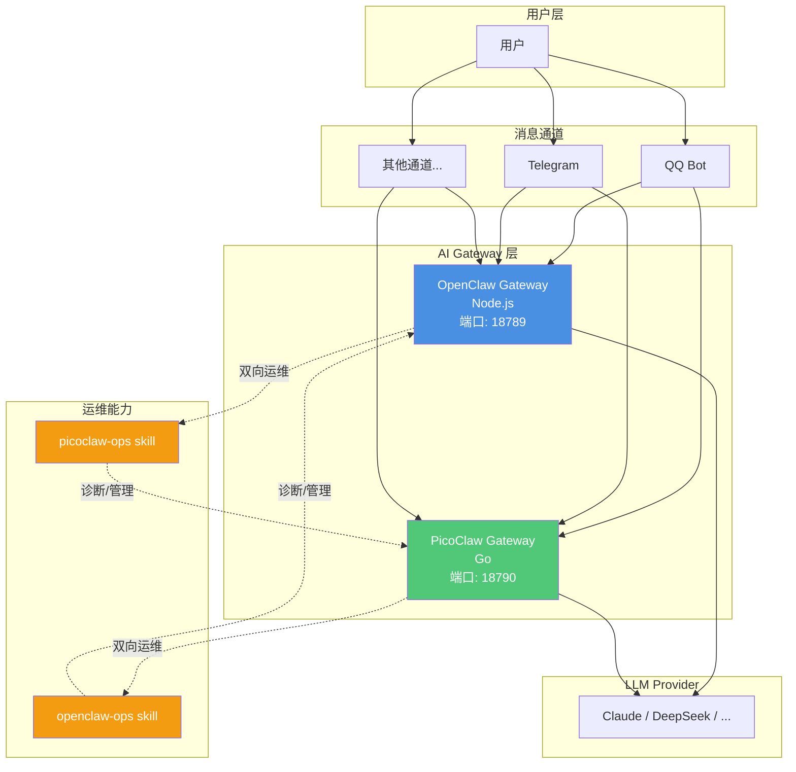

## 背景

OpenClaw 作为主力 AI 助手运行在 18789 端口，承载了大量业务逻辑。为了提高系统可用性和运维灵活性，今天部署了 PicoClaw 作为轻量级备用助手，运行在 18790 端口。

PicoClaw 是 Go 实现的轻量 AI Gateway，相比 Node.js 版的 OpenClaw，它启动更快、内存占用更小，非常适合作为运维专用助手。

### 性能对比

| 项目 | OpenClaw | NanoBot | PicoClaw |
|------|----------|---------|----------|
| 语言 | TypeScript | Python | Go |
| RAM | >1GB | >100MB | < 10MB |
| 启动时间 (0.8GHz core) | >500s | >30s | <1s |
| 成本 | Mac Mini $599 | 大多数 Linux 开发板 ~$50 | 任意 Linux 开发板 低至 $10 |


从对比可以看出，PicoClaw 在启动速度和内存占用方面都有明显优势，特别适合资源受限的环境或需要快速响应的场景。

## 架构设计

### 双活模式



| 服务 | 端口 | 管理方式 | 用途 |
|------|------|----------|------|
| OpenClaw Gateway | 18789 | systemd user 服务 | 主 AI 助手（Node.js） |
| PicoClaw Gateway | 18790 | systemd 系统服务 | 轻量 AI 助手（Go，运维专用） |

### 双向运维能力

- OpenClaw 持有 `picoclaw-ops` skill → 可以诊断和管理 PicoClaw
- PicoClaw 持有 `openclaw-ops` skill → 可以诊断和管理 OpenClaw

这样任何一方出问题，另一方都能介入修复。

## 部署流程

### 1. 安装 PicoClaw

```bash
# 下载并安装 PicoClaw v0.2.1
# 假设已有二进制文件
sudo cp picoclaw /usr/local/bin/
sudo chmod +x /usr/local/bin/picoclaw

# 初始化配置和工作区
picoclaw onboard
```

执行 `onboard` 后会生成：
- `/root/.picoclaw/config.json` — 主配置文件
- `/root/.picoclaw/workspace/` — 工作目录

### 2. 创建 systemd 服务

创建 `/etc/systemd/system/picoclaw.service`：

```ini
[Unit]
Description=PicoClaw AI Assistant Gateway
After=network.target

[Service]
Type=simple
User=root
WorkingDirectory=/root/.picoclaw
ExecStart=/usr/local/bin/picoclaw gateway
Restart=always
RestartSec=10

[Install]
WantedBy=multi-user.target
```

启用并启动服务：

```bash
sudo systemctl daemon-reload
sudo systemctl enable picoclaw
sudo systemctl start picoclaw
```

### 3. 配置消息通道

在 PicoClaw 的 `config.json` 中配置消息通道（如 QQ Bot、Telegram 等）：

```json
{
  "channels": {
    "qq": {
      "enabled": true,
      "app_id": "YOUR_APP_ID",
      "client_secret": "YOUR_SECRET",
      "is_sandbox": false
    }
  }
}
```

重启服务后，PicoClaw 会自动连接消息通道。

### 4. 模型配置

在 PicoClaw 的 `config.json` 中配置模型列表，可以参考 OpenClaw 的配置：

```json
{
  "model_list": [
    {
      "model_name": "claude-opus-4-6",
      "litellm_params": {
        "model": "anthropic/claude-opus-4-6",
        "api_base": "https://your-provider.com/v1",
        "api_key": "sk-xxx"
      }
    }
  ],
  "default_model": "claude-opus-4-6"
}
```

## 双向运维 Skill

### OpenClaw 侧：picoclaw-ops

路径：`/root/.openclaw/workspace/skills/picoclaw-ops/SKILL.md`

包含内容：
- PicoClaw 服务信息（端口、配置路径、systemd 服务名）
- 快速诊断命令（`systemctl status picoclaw`、日志查看）
- 配置结构说明
- 模型配置方法
- 常见故障排查（端口占用、API 错误、权限问题）
- 版本升级流程

### PicoClaw 侧：openclaw-ops

路径：`/root/.picoclaw/workspace/skills/openclaw-ops/SKILL.md`

包含内容：
- OpenClaw 系统架构（Gateway、定时任务）
- 诊断流程（服务状态、日志、配置检查）
- 常见问题修复（服务重启、端口冲突、模型切换）
- 配置管理（`openclaw.json` 结构、环境变量）
- 会话日志查看

## 记忆文件建设

为了让 PicoClaw 具备持久记忆，创建了 `/root/.picoclaw/workspace/memory/MEMORY.md`，包含：

- 用户信息（handry、时区、位置）
- OpenClaw 系统概况（架构、端口、服务）
- 模型配置（当前使用的 provider 和模型）
- 诊断命令速查表
- 故障修复经验（今天踩的坑）
- 安全规则（禁止修改的文件、禁止的操作）

## 验证测试

### 1. 服务状态检查

```bash
# OpenClaw
systemctl --user status openclaw-gateway

# PicoClaw
systemctl status picoclaw
```

全部显示 `active (running)`。

### 2. 端口监听

```bash
netstat -tlnp | grep -E '18789|18790'
```

输出：
```
tcp  0.0.0.0:18789  LISTEN  <pid>/node
tcp  0.0.0.0:18790  LISTEN  <pid>/picoclaw
```

### 3. 消息通道连接

配置的消息通道都能正常收发消息，互不干扰。

### 4. 双向运维能力

- 在 OpenClaw 中询问 "PicoClaw 状态如何？" → 自动调用 `picoclaw-ops` skill，返回服务状态
- 在 PicoClaw 中询问 "OpenClaw 运行正常吗？" → 自动调用 `openclaw-ops` skill，返回服务状态

## 总结

通过今天的部署，实现了：

1. **双活架构**：OpenClaw + PicoClaw 同时运行，互为备份
2. **双向运维**：任何一方都能诊断和修复另一方
3. **模型对齐**：两边使用相同的 LLM provider 配置
4. **记忆同步**：PicoClaw 持有 OpenClaw 的系统知识

下一步计划：
- 配置 PicoClaw 的定时任务（健康检查、日志清理）
- 实现两个助手之间的消息转发（互相唤醒）
- 探索 PicoClaw 的性能优势（启动速度、内存占用）

## 参考资料

- [PicoClaw 官网](https://picoclaw.io/)
- [PicoClaw GitHub](https://github.com/sipeed/picoclaw)
- [OpenClaw 文档](https://docs.openclaw.ai)
- [systemd 服务管理](https://www.freedesktop.org/software/systemd/man/systemd.service.html)
